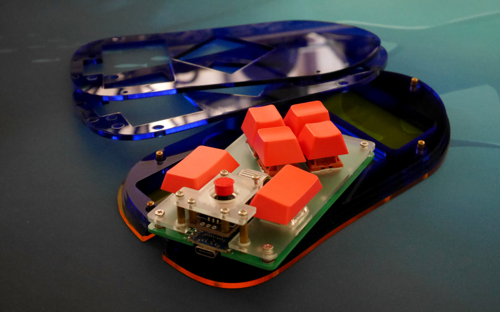

# ISW-SEASLUG

ISW-SEASLUG is designed for use in combination with a trackball or joystick.

[Build guide](doc/buildguide.md)

## Dependencies (KiCad)
* [is-watering/isw-kbd-lib](https://github.com/is-watering/isw-kbd-lib)
* [Salicylic-acid3/KiCAD_FootPrint](https://github.com/Salicylic-acid3/KiCAD_FootPrint)
* [koktoh/BrownSugar_KBD_KiCad_Library](https://github.com/koktoh/BrownSugar_KBD_KiCad_Library)
