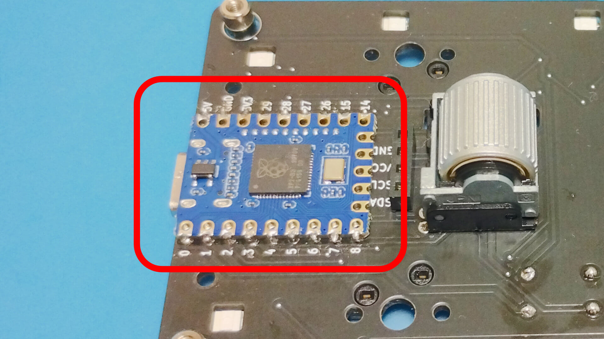

# Build guide

## Parts
Name                     |Quantity |Notes
-------------------------|---------|-----
PCB                      |1        |[Here's the data](https://github.com/is-watering/isw_seaslug/tree/main/hardware/pcb)|
Switch plate             |1        | |
Bottom plate             |1        | |
Cover plate              |1        | |
SK6812 MINI-E leds       |10       | |
1N4148W diodes           |6        | |
Kailh hotswap sockets    |6        | |
RP2040-Zero              |1        | |
M2x4mm screws            |12        | |
M2x7mm spacers           |4        |[HIROSUGI NET](https://www.hirosugi-net.co.jp/shop/c/c10141012/)|
M2x12mm Knurled spacers   |2        |[Aliexpress](https://www.aliexpress.com/item/1005002979083511.html)|

### Optionally
Name |Quantity |Notes
-----|---------|-----
EVQWGD001 rotary encoder  |1    |[Aliexpress](https://www.aliexpress.com/item/32990950196.html), [TALPKEYBOARD](https://talpkeyboard.net/items/65cdb71207d2c4002b622ce0), [Yushakobo](https://shop.yushakobo.jp/products/3971)|
1N4148W diodes            |1    |Used when EVQWGD001 is installed|
AZ1UBALL                  |1    |Only one of this or StickPointV can be attached. [Booth](https://booth.pm/ja/items/4202085)|
StickPointV               |1    |Only one of this or AZ1UBALL can be attached. Also, use those without glove socket mounts. [Booth](https://booth.pm/ja/items/5404009)|
FSS-41035-04 4P pinsocket |1    |Used when AZ1UBALL or StickPointV is installed. [HIROSUGI NET](https://www.hirosugi-net.co.jp/shop/goods/goods.aspx?goods=24081), [Yushakobo](https://shop.yushakobo.jp/products/a1600ps-01-1)|
PSS-410153-04 4P pinheader |1    |Used when AZ1UBALL or StickPointV is installed. [HIROSUGI NET](https://www.hirosugi-net.co.jp/shop/g/g21243/), [Yushakobo](https://shop.yushakobo.jp/products/a1600ph-01-1)|
M2x6mm Knurled spacers     |4        |Used when StickPointV is installed. [Aliexpress](https://www.aliexpress.com/item/1005002979083511.html)|
M2x14mm Knurled spacers    |4        |Used when StickPointV is installed. [Aliexpress](https://www.aliexpress.com/item/1005002979083511.html)|

## Build PCB

### [Leds](https://github.com/is-watering/isw-kbd-building-tips/blob/main/doc/soldering-sk6812mini-e.md)

### [Diodes](https://github.com/is-watering/isw-kbd-building-tips/blob/main/doc/soldering-1n4148w.md)

### [Hotswap sockets](https://github.com/is-watering/isw-kbd-building-tips/blob/main/doc/soldering-cpg151101s11.md)

### RP2040-Zero
It is recommended to check whether the firmware can be written to the microcontroller in advance.
* [Remap](https://remap-keys.app/catalog/YQ8QgcHbuajsV3Ugj0US)
* [Soure code](https://github.com/is-watering/isw_seaslug/tree/main/firmware)

Solder the microcontroller from the top of the PCB, face down, using surface mount soldering.  
[Learn more about how to solder microcontrollers](https://github.com/is-watering/isw-kbd-building-tips/blob/main/doc/surfacemount-rp2040-zero.md)  

Fix 12mm Knurled spacers with 4mm screws.  
If StickPointV is to be installed, secure with 14mm Knurled spacers instead of 12mm.

## Build Case
Use a 4mm screw to secure the 7mm spacer.  

Place the PCB on the bottom plate.  

Place the switch plate on the PCB. It is easier to align key switches if they are mounted from the corners.  
Then fix the switch plate with 4mm screw.  

Install the remaining key switches and then screw the cover plate in place.  

Attach a keycap of your choice to complete the process!  

Congratulations on the completion!  
Please be proud of it on social networking sites!  
`#isw_kbd`

## Build Optionally
### [EVQWGD001 rotary encoder](https://github.com/is-watering/isw-kbd-building-tips/blob/main/doc/soldering-evqwgd001.md)

### AZ1UBALL or StickPointV
[!IMPORTANT]
When installing the StickPointV, replace the 12 mm knurled spacer fixed to the PCB with a 14 mm knurled spacer.

[Please solder the 4P pinsocket to the PCB in advance.](https://github.com/is-watering/isw-kbd-building-tips/blob/main/doc/soldering-4p-pinsocket.md)  

Secure the pointing device to the cover plate with 4 mm screws.  
[!IMPORTANT]
When installing the StickPointV, replace the spacer supplied with the StickPointV with a 6 mm knurled spacer.  

Plug the pointing device into the 4P pin socket.  
Then secure the cover plate with a 4 mm screws.  
